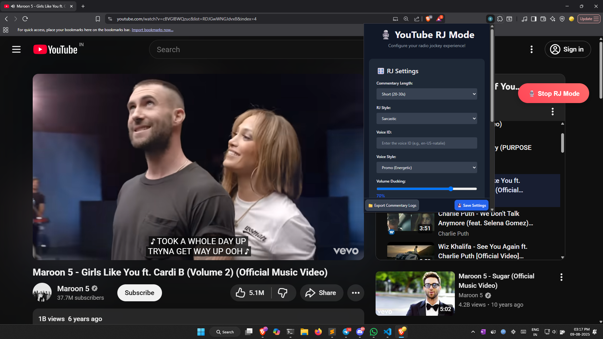

### Youtube Radio Jockey Chrome extension

### Todo list

- Add option to start rj commentry at start or end
- Add Instant commentary button

### Features

- Generate and keep the script and commentary audio ready earlier , soon as 10 seconds of video playback
- Typescirpt codebase
- Provide more persona to rj like her name , radio name , etc
- Include lyrics of the song for more context



- You will need

  https://aistudio.google.com/apikey (required)

  https://murf.ai/api/api-keys (optional , try free api) (fallbacks to edge-tts otherwise)

- Youtube Playlist

  https://www.youtube.com/watch?v=LjhCEhWiKXk&list=RDJGwWNGJdvx8&index=28

### Installation

Download and extract this zip file to a folder , then go to extensions > enable developer mode > load unpacked and choose the folder > chose the /dist folder

- https://github.com/rayanfer32/youtube-radio-jockey/archive/refs/heads/main.zip

### Development

```sh
git clone https://github.com/rayanfer32/youtube-radio-jockey

bun install

bun dev

bun run build # production
```

### Good Edge TTS voices:

- en-US-AriaNeural
- en-GB-RyanNeural
- en-US-BrianMultilingualNeural

* en-US-AndrewMultilingualNeural
* en-US-AriaNeural
* en-US-BrianMultilingualNeural
* en-US-AvaMultilingualNeural
* en-US-ChristopherNeural
* en-CA-ClaraNeural
* en-US-EricNeural
* en-US-EmmaMultilingualNeural
* en-US-GuyNeural
* en-US-JennyNeural
* en-US-RogerNeural
* en-US-MichelleNeural
* en-GB-LibbyNeural
* en-US-SteffanNeural
* en-GB-SoniaNeural
